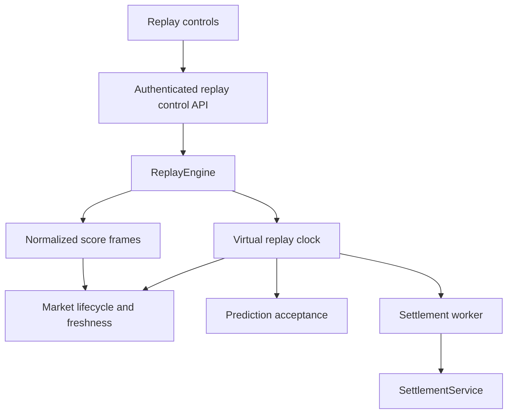
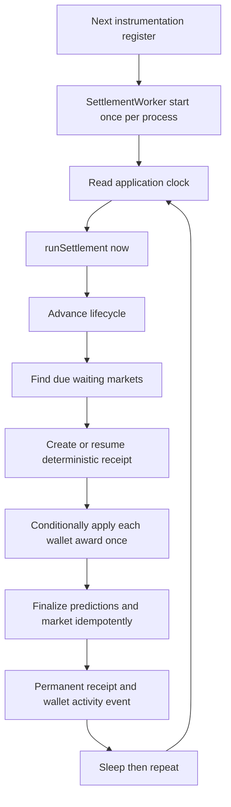

# FlashBets Architecture

## Active layers

| Layer | Files | Responsibility |
| --- | --- | --- |
| Mode and clock | `lib/app-mode.ts`, `lib/server/application-clock.ts` | Configuration-only source choice and authoritative market time |
| Live adapter | `lib/txLineClient.ts`, `lib/txline-normalize.ts`, `lib/txline-fixtures.ts` | Server credentials, live normalization, duplicate/out-of-order rejection |
| Replay adapter | `lib/replay/*`, `lib/server/replay/*`, `replays/*.json` | Dataset validation, deterministic playback, replay run identity, stream fan-out |
| Domain and policy | `lib/domain/flash-bets.ts`, `lib/market-policy.ts` | DTOs, stable windows/IDs, freshness, lifecycle boundaries |
| Services | `lib/server/*-service.ts` | Authentication, markets, predictions, rewards, receipts, settlement, migration |
| Worker | `instrumentation.ts`, `lib/server/settlement-worker.ts` | Periodically invokes SettlementService using authoritative application time |
| Repositories and DB | `lib/server/repositories/*`, `lib/server/db/*` | Mongoose queries, schemas, unique indexes, atomic document updates, capability detection, and optional transactions |
| API | `app/api/*` | Authentication, same-origin/input checks, SSE and response DTOs |
| UI | `components/*`, `lib/hooks/*` | Renders server state and invokes APIs; never calculates results or balances |

## Event-source boundary

```mermaid
flowchart LR
    L[TxLINE live HTTP/SSE] --> N[normalizeScoresUpdate]
    N --> U[TxLineScoresUpdate]
    D[replays/*.json] --> V[Replay validation]
    V --> E[ReplayEngine]
    E --> U
    U --> M[MarketService ingestTxLineScores]
    M --> F[FixtureRepository]
    M --> P[Canonical market policy]
    P --> R[MarketRepository]
    U --> S[/api/stream SSE]
    S --> UI[Match UI]
```

Replay files store the same normalized `TxLineScoresUpdate` contract produced by
the live normalizer. The ReplayEngine projects run-specific fixture ID,
sequence, and virtual timestamp values, but it does not implement market or
settlement rules.

`FLASHBETS_MODE` is read only on the server. It decides which adapter backs the
dashboard and `/api/stream`; no UI toggle can switch trust sources at runtime.

## Replay and business time



The engine owns one timer and a deterministic list of emission times. Pause
freezes virtual time. Speed changes reset the wall-time reference without changing
event order. Authentication challenges and sessions deliberately continue to
use real server time.

An active replay run is process-local for the hackathon demo. Fixtures, markets,
predictions, balances, and receipts are durable in MongoDB. A server restart
loses playback position but not ledger history. Multi-instance production use
would require a durable replay coordinator and shared event bus.

## Automatic settlement



Scheduling is separate from `SettlementService`. The worker never calculates an
outcome itself, never accepts a browser result, prevents overlapping cycles, and
sleeps after success or failure. The deterministic receipt is persisted before
awards are applied. Each wallet update conditionally records that receipt ID in
the same document as its balance/stat changes, so retries and concurrent workers
cannot apply the same award twice. Prediction and market finalization accept
only an unfinished record or the same already-applied receipt.

## MongoDB capability and standalone coordination

`lib/server/db/mongoose.ts` runs MongoDB's `hello` command after connecting. A
replica set or mongos with logical sessions selects `transactional` mode. A
standalone server selects `standalone` mode; a transaction-unsupported response
also falls back without refusing startup.

The same service and repository APIs are used in both modes:

- account creation uses a unique wallet index and `$setOnInsert`, guaranteeing
  one account and one initial 1,000-point grant;
- authentication consumes a challenge with a conditional one-document update;
- standalone prediction placement creates the deterministic prediction first,
  conditionally moves available points to locked, and deletes the reservation
  if that lock is definitively rejected;
- settlement creates one deterministic receipt, then uses receipt-marked
  conditional wallet updates and idempotent prediction/market finalizers; and
- replay restart uses the same void receipt and refund path.

Transactions remain an optimization and stronger cross-document failure
boundary when available. Standalone mode cannot make an arbitrary sequence of
separate documents all-or-nothing; the flows are instead retryable and
idempotent, with the specific residual windows documented in
`STANDALONE_MONGODB_CHECKPOINT.md`.

## Trust boundaries

- TxLINE is authoritative in Live Mode.
- The selected replay dataset is authoritative only for an explicitly labeled
  Replay run.
- The Next.js server owns source selection, replay time, lifecycle, result,
  reward/refund, and receipts.
- The browser supplies only replay commands, market ID, Yes/No side, and integer
  amount. Services revalidate all mutable operations.
- MongoDB is the durable FlashPoints ledger. Standalone MongoDB is supported;
  transactions are detected and used automatically when available.
- Wallet Adapter proves identity through a signed authentication message.

## Product and presentation boundary

Prompt 4 keeps the server-owned product model unchanged while making the
existing journey explicit in the interface:

```mermaid
flowchart LR
    H[AppHeader and mode banner] --> D[Dashboard fixtures]
    D --> M[LiveMatchArena]
    M --> C[Canonical markets]
    C --> P[Prediction dialog]
    P --> API[PredictionService API]
    API --> DB[(MongoDB ledger)]
    DB --> W[Automatic settlement worker]
    W --> R[Permanent receipt]
    R --> A[Wallet activity SSE]
    A --> MP[My Predictions]
```



- `components/app-header.tsx`, `components/mode-banner.tsx`, and
  `components/bottom-nav.tsx` keep identity, balance, source mode, and primary
  destinations visible across the product.
- Route-level `loading.tsx`, `app/error.tsx`, and `app/not-found.tsx` provide
  bounded skeleton, recovery, and missing-page states.
- `useTxLineStream` owns one EventSource, a ten-second initial-data timeout,
  retry generation, and complete timer/stream cleanup.
- `useCanonicalMarkets` aborts superseded requests and coalesces rapid replay
  frames so 10x playback does not issue a market request for every score event.
- `usePredictions` keeps one request in flight and deduplicates activity and
  visibility refreshes. Activity SSE remains view-only.
- `PredictionBottomSheet` sends only market ID, side, and integer stake. It
  shows authoritative balance and status but does not calculate or settle the
  result.
- `PredictionService` enriches history DTOs with fixture context for receipt
  presentation; stored market, prediction, receipt, and reward rules are
  unchanged.
- The Dashboard server component merges the current TxLINE catalog with durable
  `FINISHED` Live fixtures. ReplayService returns the replay catalog separately
  from durable completed run fixtures, so the Replay and Finished segments do
  not hide one another and history survives process-local replay changes.

Client-facing errors are mapped to actionable copy without displaying upstream
responses, connection strings, or credentials. Server and replay error logging
uses fixed context plus error class only.
