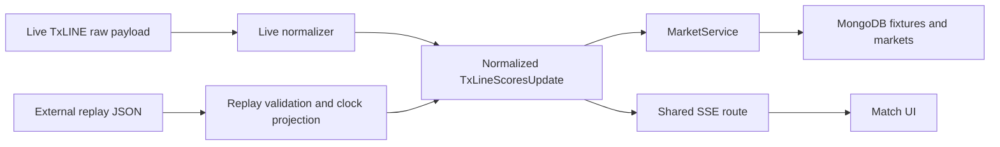
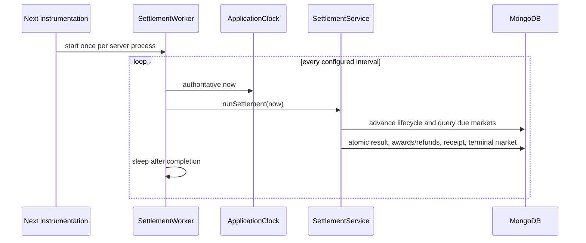

# FlashBets Replay Checkpoint 3

> Prompt 3.5 supersedes this document's replica-set and mandatory-transaction
> deployment requirements. Replay behavior is unchanged. See
> `STANDALONE_MONGODB_CHECKPOINT.md` for the active persistence model; this file
> otherwise preserves the Prompt 3 handoff.

> Prompt 4 adds presentation, accessibility, bounded failure states, replay
> restart confirmation, completion actions, and request deduplication without
> changing ReplayEngine, virtual-time, market, prediction, settlement, reward,
> refund, or receipt rules. The current standalone suite result is 30/30 and the
> current development smoke passes. See `POLISH_CHECKPOINT.md` and
> `JUDGE_WALKTHROUGH.md` for the active handoff.

## Scope

Prompt 3 adds a deterministic, judge-ready Replay Mode and an automatic
settlement worker without creating a second business path. The existing Prompt
2 MongoDB repositories, `MarketService`, `PredictionService`, reward rules,
`SettlementService`, receipts, and signed-wallet identity remain authoritative.

## Replay architecture



The mode switch is the server-only `FLASHBETS_MODE=LIVE|REPLAY` configuration.
`app/dashboard/page.tsx` and `app/api/stream/route.ts` select the source. There is
no browser switch and no code path that silently falls back from Live to Replay.

Live Mode retains the existing `normalizeScoresUpdate` path. Replay files store
the exact normalized `TxLineScoresUpdate` contract produced at that boundary, so
there is no replay-only event model. Replay validation rejects malformed,
empty, unordered, or incorrectly bounded timelines.

## Replay file format

Datasets live outside application code under `replays/*.json`. Two fixtures are
included:

- `world-cup-brazil-argentina.json`: a Goal-Yes outcome in the 85–90 window;
- `champions-cup-atlas-riverside.json`: Goal-No and Corner-Yes outcomes in the
  70–75 window.

They are curated deterministic TxLINE-normalized demonstration records. Their
shape supports replacing them with approved recorded TxLINE data without
changing ReplayEngine or business services.

### File contract

```json
{
  "version": 1,
  "id": "stable-replay-id",
  "title": "Judge-facing title",
  "competition": "Competition",
  "description": "What the replay demonstrates",
  "fixture": {
    "fixtureId": 710001,
    "participants": ["Home", "Away"],
    "finalScore": [1, 0]
  },
  "durationMs": 780000,
  "frameIntervalMs": 15000,
  "timeline": [
    {
      "atMs": 0,
      "update": {
        "fixtureId": 710001,
        "seq": 1,
        "ts": 0,
        "gameState": 4,
        "matchPhase": "SECOND_HALF",
        "sourceState": "H2",
        "sourceTimestampTrusted": true,
        "matchMinute": 80,
        "participants": ["Home", "Away"],
        "stats": { "1": 0, "2": 0, "7": 0, "8": 0 },
        "availableStats": [1, 2, 7, 8],
        "isComplete": true
      }
    }
  ]
}
```

`atMs` is a monotonically increasing offset on the replay timeline. The first
entry must be at zero and no entry may exceed `durationMs`. `frameIntervalMs`
adds deterministic intermediate frames from the last known normalized update,
keeping fixture freshness and match time moving without inventing score events.

At runtime ReplayEngine replaces dataset fixture ID, sequence, and timestamp
with run-specific values. It preserves normalized phase, participants, stats,
completeness, and key-frame event facts. A new run-specific numeric fixture ID
keeps canonical market IDs stable within a run while ensuring Restart never
rewinds an already-final market.

## ReplayEngine

`lib/replay/replay-engine.ts` is independent of React, MongoDB, and settlement
logic. It:

- loads a validated dataset through the server adapter;
- emits the first frame while paused so a judge can place a prediction;
- supports Play, Pause, Restart through the service, and speeds 0.5×, 1×, 2×,
  5×, and 10×;
- maintains a single scheduled timer;
- freezes authoritative time while paused;
- resets the wall-time reference on speed changes without reordering events;
- emits deterministic intermediate and key frames; and
- reaches a terminal `FINISHED` state exactly at `durationMs`.

The active ReplayEngine is process-local. It survives page refreshes while the
server process stays alive because the runtime is held in a `globalThis`
singleton. Playback position does not survive a server restart. Durable fixture,
market, prediction, balance, and receipt records do survive because they are in
MongoDB.

## Server-owned replay time

`lib/server/application-clock.ts` provides the authoritative business clock.
It defaults to `Date.now()` and is registered to ReplayEngine virtual time after
a replay is selected.

Replay time controls:

- normalized source and receive timestamps;
- fixture freshness;
- market creation, opening, lock, start, end, and correction delay;
- server-side prediction acceptance; and
- automatic settlement due scans.

Authentication challenge expiry, session expiry, cookie lifetime, and wallet
signature verification continue to use real server time. This separation avoids
speeding up or pausing security credentials.

## Restart and interrupted runs

Restart does not mutate a terminal market backward. The replay service pauses
the current engine, records an `ABANDONED` normalized update, and sends unfinished
markets through the existing `settleMarket` path. Any locked prediction is
voided and refunded with a permanent receipt. A fresh run ID and numeric fixture
ID are then created and the first frame is emitted paused.

Selecting a different replay uses the same interrupted-run cleanup.

## Worker architecture



`instrumentation.ts` starts `lib/server/settlement-worker.ts` in the Node.js
runtime. Scheduling and business logic are separate: the worker only obtains the
clock, calls `runSettlement`, reports errors, and schedules the next non-
overlapping cycle. The default interval is 1,000ms and is configurable with
`SETTLEMENT_WORKER_INTERVAL_MS`.

## Automatic settlement

No browser request, polling loop, replay control, or manual settlement button is
required for settlement. `POST /api/settlement/run` remains a development-only
Prompt 2 diagnostic adapter; the product UI does not call or expose it.

After prediction placement or committed settlement, the server publishes a
wallet-scoped activity event through `/api/activity`. My Predictions refreshes
from that event and on tab visibility. This stream only updates the view; it
never schedules or calculates settlement.

## Replay lifecycle

1. `DashboardPage` lists validated replay summaries.
2. An authenticated wallet posts a replay ID to `/api/replays/select`.
3. ReplayService creates a run and ReplayEngine emits its first normalized frame
   while paused.
4. `ingestTxLineScores` persists the fixture and creates stable Goal/Corner
   markets using the existing market policy.
5. The shared `/api/stream` sends scores and replay state to `LiveMatchArena`.
6. The user selects Yes/No and a whole FlashPoints amount.
7. `PredictionService` revalidates authoritative replay time and freshness,
   atomically moves available points to locked, and stores the prediction.
8. Play advances virtual time. The same normalized ingestion advances OPEN to
   LOCKED and then WAITING_FOR_SETTLEMENT.
9. Dataset score/corner changes update the cumulative normalized counters.
10. After `settlesAt`, SettlementWorker calls `runSettlement` with replay time.
11. SettlementService calculates closing minus immutable opening snapshot,
    applies exact integer rewards or refunds, finalizes market/predictions, and
    writes one permanent receipt in a MongoDB transaction.
12. A wallet activity SSE message refreshes My Predictions and balance display.

## Replay controls and presentation

Replay controls are rendered only in Replay Mode and include:

- Play/Pause;
- Restart;
- 0.5×, 1×, 2×, 5×, and 10× speed;
- progress bar;
- current replay time and duration; and
- the required explanation that historical TxLINE replay data demonstrates the
  prediction lifecycle.

The root layout always renders a Live or Replay mode banner. The dashboard uses
separate Replay, Finished, and Unavailable segments in Replay Mode. Live Mode
retains Live, Upcoming, Finished, and Unavailable segments.

My Predictions is newest-first and offers All, Active (Accepted or Locked),
Won, Lost, Refunded, Void, Replay, and Live filters. Receipt details include ID, result, reason,
delta, source timestamps, pool totals, correction delay, version, and settlement
time.

## APIs

| Method | Route | Authentication | Purpose |
| --- | --- | --- | --- |
| GET | `/api/replays` | Public | Mode, replay catalog, and active state |
| POST | `/api/replays/select` | Wallet session + same-origin | Select dataset and create paused run |
| POST | `/api/replays/control` | Wallet session + same-origin | Play, Pause, Restart, or set allowed speed |
| GET | `/api/stream?fixtureId=...` | Public | Active Live or Replay score/state SSE |
| GET | `/api/activity` | Wallet session | Wallet-scoped prediction/settlement SSE |
| GET | `/api/markets?fixtureId=...` | Public | Canonical fixture and markets |
| GET/POST | `/api/predictions` | Wallet session for both; same-origin for POST | History/account or placement |

Replay selection and controls are mutations and cannot be called cross-origin or
without a signed-wallet session.

The Replay dashboard segment always retains the selectable dataset catalog. The
Finished segment loads durable completed replay-run fixtures from MongoDB, so a
completed run remains visible after another run is selected or the server loses
its process-local playback position.

## Historical Prompt 3 tests

`npm run test:replay` runs the complete focused suite against an isolated
temporary MongoDB replica set. There are 25 passing tests. Prompt 3 coverage
includes:

- configuration-only Live/Replay selection;
- loading at least two external normalized datasets;
- chronological validation;
- pause, resume, deterministic speed, and completion;
- worker immediate-run/sleep/repeat/stop behavior without overlap;
- replay frame ingestion through the real MarketService;
- automatic due settlement through the real SettlementService;
- Replay source metadata on durable markets/history;
- winning result, immutable snapshots, receipt fields, and unlocked balance; and
- all inherited authentication, placement, migration, market, reward, void, and
  idempotency tests.

The Replay Mode development smoke test also passed. It started an isolated
replica set and `next dev`, opened `/`, `/dashboard`, a dynamic match,
`/my-predictions`, `/my-bets`, `/leaderboard`, market/prediction/replay APIs,
completed signed ephemeral-wallet authentication, selected a replay, confirmed
canonical markets, selected 10× speed, invoked the development settlement
diagnostic, logged out, and verified the old session was rejected.

No production build, lint command, ESLint command, or standalone TypeScript
compiler was run during this historical checkpoint.

## Documentation changes

- `README.md` now describes Replay Checkpoint 3 and the judge demo.
- `ARCHITECTURE.md` documents source adapters, clock ownership, and worker flow.
- `ENVIRONMENT.md` and `.env.example` document mode and worker configuration.
- `SETTLEMENT_CHECKPOINT.md` remains the Prompt 2 settlement truth source.
- This file is the Prompt 3 handoff.

## Remaining work

- Replace curated demonstration datasets with approved, provenance-documented
  recorded TxLINE exports before representing them as verified historical
  captures outside the demo.
- Persist replay run position and coordinate playback through a shared event bus
  before running multiple Next.js instances.
- Add structured worker/replay logs, metrics, health checks, and alerting.
- Configure and validate a durable transaction-capable MongoDB deployment.
- Verify Live Mode against valid TxLINE credentials and real live/correction
  behavior.
- Add broader browser-level interaction coverage if required after the
  hackathon checkpoint.

Prompt 3 is complete at this boundary. Prompt 4 begins from this document.
