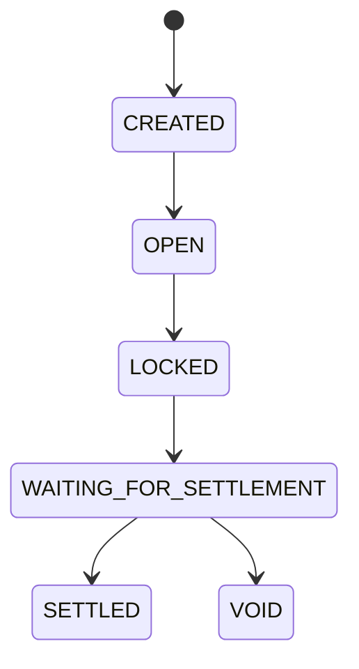

# FlashBets Settlement Checkpoint 2

> Prompt 2 historical checkpoint. Prompt 3 now starts the automatic worker and
> Replay Mode described in `REPLAY_CHECKPOINT.md`; the settlement rules below
> remain the active business rules.
>
> Prompt 3.5 supersedes this document's replica-set and mandatory-transaction
> deployment requirements. See `STANDALONE_MONGODB_CHECKPOINT.md` for the active
> persistence model; this file otherwise preserves the Prompt 2 handoff.
>
> Prompt 4.5 is the release-candidate truth source; see
> `FINAL_RELEASE_CHECKPOINT.md` for current verification. Test counts below are
> preserved as historical Prompt 2 evidence.

## Architecture

Prompt 2 completes the off-chain FlashPoints prediction lifecycle and replaces
the Prompt 1 JSON runtime with MongoDB/Mongoose.

```text
UI
  -> Next.js route handler
  -> service layer
  -> repository layer
  -> Mongoose model
  -> MongoDB transaction-capable deployment
```

Application services do not issue Mongoose queries. All persistence operations
are isolated in `lib/server/repositories`; schemas and connection management live
in `lib/server/db`.

The settlement engine is `runSettlement` in
`lib/server/settlement-service.ts`. It accepts a clock value and has no HTTP
dependency, so a future cron, queue, worker, or scheduled function can invoke it
without rewriting settlement logic. `POST /api/settlement/run` is only a
development adapter.

MongoDB multi-document transactions are mandatory. Prediction placement and
settlement fail clearly when `MONGODB_URI` points at a standalone server because
standalone MongoDB cannot make the ledger changes atomic.

## MongoDB schema

Mongoose schemas are defined in `lib/server/db/models.ts`. Domain DTOs use ISO
timestamp strings and safe integer FlashPoints.

### WalletAccount

| Field | Meaning |
| --- | --- |
| `wallet` | Unique canonical Solana wallet address |
| `available` | Spendable FlashPoints balance |
| `locked` | Stakes awaiting settlement |
| `won` | Cumulative gross rewards awarded |
| `lost` | Cumulative losing stakes |
| `refunded` | Cumulative void refunds |
| `createdAt`, `updatedAt` | Audit timestamps |

### Fixture

`Fixture` stores only normalized settlement facts: fixture ID, participants,
phase, match minute/second, cumulative Goal and Corner counts, source sequence,
source/receive timestamps, trust/completeness flags, source, and update time.

### Market

`Market` stores `marketId`, `fixtureId`, Goal/Corner type, half, five-minute
bounds, `opensAt`, `locksAt`, `startsAt`, `endsAt`, `settlesAt`, the correction
delay captured at creation, lifecycle status, immutable opening snapshot,
closing snapshot, result, receipt reference, question/source, and audit times.

The extra `startsAt` and `endsAt` fields make the betting lock, five-minute event
window, and correction delay independently auditable. Market IDs are unchanged
from Prompt 1.

### Prediction

`Prediction` stores `predictionId`, wallet, market ID, `YES`/`NO` side, integer
amount, status, receipt reference, gross reward, refund, created/updated time,
and settlement time. A unique compound index on wallet plus market enforces one
prediction per wallet per market.

### SettlementReceipt

One permanent receipt is stored per market. It includes fixture/market IDs,
reason, TxLINE opening and closing timestamps, both snapshots, delta, winning
side, correction delay, settlement version, total/winning pools, pre-allocation
remainder, per-prediction awards/refunds, and settlement time. Both `receiptId`
and `marketId` are unique.

### Authentication collections

`wallet_challenges` and `wallet_sessions` keep Prompt 1 authentication durable.
Only hashes of opaque session tokens are persisted.

## Collections

| MongoDB collection | Repository |
| --- | --- |
| `wallet_accounts` | `wallet-account-repository.ts` |
| `fixtures` | `fixture-repository.ts` |
| `markets` | `market-repository.ts` |
| `predictions` | `prediction-repository.ts` |
| `settlement_receipts` | `receipt-repository.ts` |
| `wallet_challenges`, `wallet_sessions` | `auth-repository.ts` |

`test-repository.ts` exists only to clear and count isolated test collections.
It is not imported by application runtime code.

## Migration

Run the idempotent migration once against the target transaction-capable
database:

```powershell
npm run migrate:mongo
```

`FLASHBETS_JSON_MIGRATION_PATH` defaults to
`.data/flash-bets-foundation.json` and is constrained to the workspace. The
migration preserves Prompt 1 fixture, market, prediction, wallet, FlashPoints,
challenge, and session IDs and values. Old market fields such as `id`,
`windowStartMinute`, `selection`, and `flashPoints` map to the Mongo schema
without changing canonical IDs. Re-running performs upserts and does not create
duplicates.

The migration never deletes the JSON source. Runtime code no longer imports a
JSON store, and `lib/server/mvp-store.ts` has been removed. The current local
Prompt 1 source was successfully migrated during the runtime verification: two
wallet accounts, three challenges, and three sessions; it contained no fixtures,
markets, predictions, or receipts. The same path is also covered by an isolated
idempotency integration test.

Prompt 1 reserved a different per-prediction receipt shape but never produced
such records. The migration reports any non-empty legacy receipt it cannot map;
the verified source contained zero and skipped zero.

## Settlement lifecycle

The lifecycle is forward-only:



- `CREATED`: server time is before `opensAt`.
- `OPEN`: `opensAt <= now < locksAt`; predictions may be accepted.
- `LOCKED`: `locksAt <= now < endsAt`; pending predictions become `LOCKED`.
- `WAITING_FOR_SETTLEMENT`: `now >= endsAt`; settlement remains blocked until
  `settlesAt`.
- `SETTLED` or `VOID`: terminal and never moves backward.

At the first trusted update that advances a market into `OPEN`, Goal and Corner
counts are captured in `openingSnapshot`. That snapshot is never overwritten. If
the process misses the opening transition, it does not fabricate a late baseline;
missing opening evidence causes a void.

At or after `settlesAt`, settlement captures the latest trusted complete fixture
as `closingSnapshot`. Its source timestamp must be at least the market end, so an
old opening-time fixture cannot incorrectly produce a `NO` result after the feed
stops. The relevant closing counter minus opening counter is the only result
input; absolute totals are never compared directly.

- Goal delta greater than zero: `YES`.
- Goal delta zero: `NO`.
- Corner delta greater than zero: `YES`.
- Corner delta zero: `NO`.

`SETTLEMENT_DELAY_SECONDS` defaults to 120. `settleMarket` rejects even one
millisecond before `settlesAt`.

## Reward calculation

The model has no odds or floating point.

1. Sum every unsettled prediction amount into the total pool.
2. Sum amounts on the winning side into the winning pool.
3. For each winner calculate
   `floor(totalPool * amount / winningPool)` with `BigInt`.
4. Calculate the unallocated integer remainder.
5. Sort winners by `predictionId` and add one point to the first `remainder`
   winners.

The floor remainder is always smaller than the winner count, so this distributes
the complete pool deterministically and preserves every integer point.

Winner accounting decreases `locked` by the stake, increases `available` and
the cumulative `won` statistic by the gross reward, and records the reward on the
prediction. Loser accounting decreases `locked` and increases cumulative `lost`
by the stake. A valid result with a non-empty pool but no prediction on the
winning side is voided instead of burning the pool.

## Void rules

A market is voided for:

- abandoned or cancelled/postponed fixture state;
- missing fixture;
- unknown fixture state;
- incomplete or untrusted TxLINE data;
- closing data older than the market end;
- missing opening or closing snapshot;
- settlement after `SETTLEMENT_TIMEOUT_SECONDS` (default 900 after
  `settlesAt`);
- negative/unsafe delta or internal calculation failure; or
- no prediction on the winning side when the pool is non-empty.

Void accounting returns each exact stake to `available`, removes it from
`locked`, increases `refunded`, records the refund on the prediction, and marks
the prediction and market `VOID`. The receipt records the reason.

## APIs

| Method | Route | Authentication | Behavior |
| --- | --- | --- | --- |
| GET | `/api/markets?fixtureId=...` | Public | Fixture freshness plus persisted lifecycle, snapshots, result, and receipt reference |
| GET | `/api/predictions` | Required | Wallet predictions with market, status, reward, refund, full receipt, and account |
| POST | `/api/predictions` | Required, same-origin | Transactionally lock points and insert one prediction |
| POST | `/api/settlement/run` | Required, same-origin, development only | Invoke `runSettlement`; production returns 404 |

Existing signed authentication and FlashPoints APIs remain active. The browser
does not expose a settlement calculation or balance mutation path.

## Services

| Service | Responsibility |
| --- | --- |
| `auth-service.ts` | Signed challenge/session lifecycle in MongoDB |
| `flashpoints-service.ts` | One-time 1,000-point account creation and reads |
| `market-service.ts` | TxLINE ingestion, stable market creation, snapshot and lifecycle transitions |
| `txline-snapshot-service.ts` | Trusted normalized snapshot construction |
| `prediction-service.ts` | Placement validation, atomic locking, wallet prediction views |
| `reward-service.ts` | Pure exact integer pool and refund distribution |
| `receipt-service.ts` | Deterministic receipt identity and persistence boundary |
| `settlement-service.ts` | Due scan, decisions, atomic accounting, receipts, terminal state |
| `migration-service.ts` | Prompt 1 JSON-to-Mongo normalization and upserts |

## My Predictions

The page now supports `PENDING`, `LOCKED`, `WON`, `LOST`, `REFUNDED`, and
`VOID` status presentation. Cards display stake side/amount, FlashPoints won or
refunded, receipt ID, settlement time, winning side/delta, or void reason.
`usePredictions` refreshes every five seconds while authenticated, so a worker
settlement appears without a full page reload.

## Historical Prompt 2 tests

`npm run test:settlement` starts an isolated temporary single-node MongoDB
replica set and runs 20 focused tests serially. Coverage includes:

- signed authentication and persistent one-time account creation;
- atomic placement, validation, duplicate protection, and lock boundary;
- MongoDB persistence after reconnect;
- deterministic markets and correction timestamps;
- forward-only lifecycle and immutable opening snapshots;
- Goal winner/loser accounting;
- Corner `NO` settlement;
- void refunds;
- early-settlement refusal;
- duplicate settlement without balance changes;
- deterministic integer remainder allocation;
- worker-style settlement without HTTP;
- one receipt per market; and
- idempotent Prompt 1 migration with preserved IDs and balances.

All 20 tests pass. No replay or deployment tests were added.

`npm run smoke:settlement` starts temporary MongoDB and `next dev`, migrates the
real Prompt 1 JSON source into the temporary database, verifies `/`, dashboard,
dynamic match, My Predictions, My Bets redirect, leaderboard placeholder, and
markets API, completes signed authentication, checks 1,000 FlashPoints, invokes
the authenticated settlement runner, logs out, and confirms the old cookie is
rejected. The final smoke completed successfully.

No production build, lint command, or standalone TypeScript compiler was run as
part of this historical checkpoint.

## Remaining work

- Configure a durable transaction-capable MongoDB deployment for non-test use
  and run the migration against that target.
- Run `runSettlement` from an automatic worker/cron instead of relying on the
  development-only manual route.
- Verify opening and closing snapshots against live TxLINE fixtures and real
  correction behavior; tests use normalized synthetic updates.
- Add rate limiting, structured logs, metrics, alerting, and operator visibility
  before public exposure.
- Define retention and archival policy for fixtures, challenges, sessions, and
  permanent settlement receipts.
